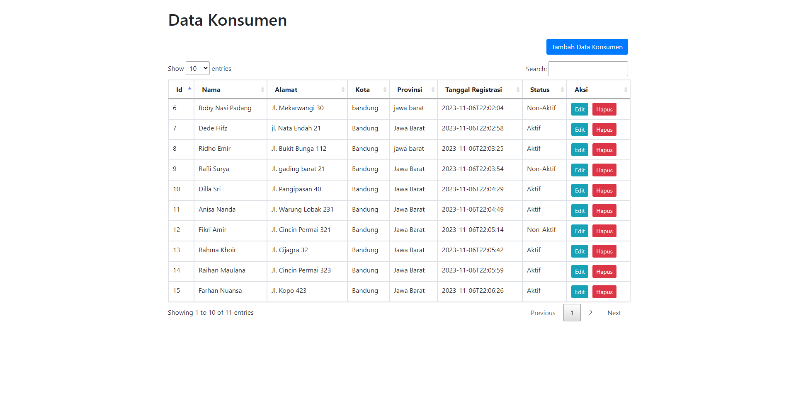

# Simple Web App (SALT Test)

## Setup Project

- Clone This Repository
- Create a New Database in MySQL with the name "salt"
- Import the SQL file to the Database
- Open the project in your IDE then Run the Spring project
- The application will run on [Port:8080](http://localhost:8080/)

## User Guide

After you open the application you will see the application display like the image above.

You can try several features such as:

* Display Data konsumen
* Add Data Konsumen
* Search Data Konsumen
* Update Data Konsumen
* Delete Data konsumen

the data will also be displayed in table form using datatable, several features are available in displaying table data such as pagination and limiting on data entries that will be displayed.
